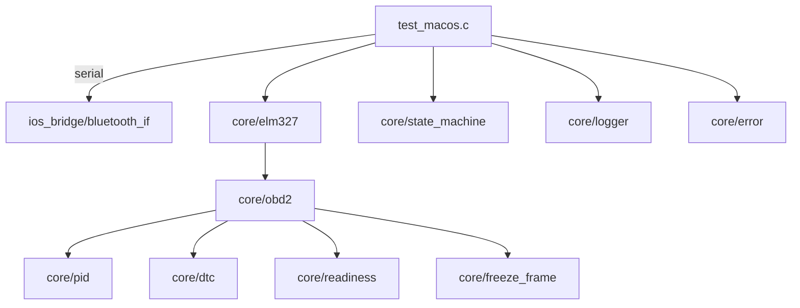

<h1 align="center">🔧 OBD2 Scanner</h1>

<h4 align="center">Leitor OBD-II com ELM327 (serial/Bluetooth) para diagnóstico automotivo</h4>

<p align="center">
  
  
  
  
  
</p>

---

## 📖 Sobre o Projeto

Leitor OBD2 que se comunica com interfaces compatíveis com ELM327 (incluindo clones), permitindo:

- 🔌 Inicialização e configuração do ELM327 (ATZ, ATE0, ATL0, ATS0, ATH0, ATSP0)
- 📡 Leitura de PIDs em tempo real (RPM, velocidade, temperatura do motor, carga, posição do acelerador)
- 🧰 Leitura/Limpeza de DTCs (códigos de falha) e captura de Freeze Frame
- 🔎 Informações do veículo (VIN) e Readiness Monitors
- 🧱 Projeto modular em C com separação de responsabilidades

> Compatível com macOS; porta serial configurável. Testado com OBDLink e adaptadores ELM327 genéricos.

---

## ✨ Tecnologias

<details>
  <summary><strong>Core</strong></summary>

- **C99** com POSIX/termios para serial
- **OBD-II** modos 01, 03, 04 e 09
- **Parser de PIDs** e gerência de estado
</details>

<details>
  <summary><strong>Arquitetura</strong></summary>

- **Modular**: elm327, obd2, pid, dtc, readiness, freeze_frame
- **Infra**: scheduler, state_machine, sanity_check, logger, error
- **Bridge**: ios_bridge/bluetooth_if (camada de transporte)
</details>

---

## 🏛️ Arquitetura



---

## 🚀 Como Executar (macOS)

**Pré-requisitos:**
- GCC/Clang e Make (Xcode Command Line Tools)

```bash
xcode-select --install
```

**1) Compilar biblioteca do core:**
```bash
make
```

**2) Compilar o scanner de exemplo:**
```bash
gcc -std=c99 -Wall -Wextra -O2 -I. test_macos.c -o obd2_scanner
```

**3) Executar (escolha sua porta):**
```bash
./obd2_scanner /dev/tty.OBDLinkMX
# ou
./obd2_scanner /dev/tty.OBDII-SPP
# listar portas disponíveis
ls /dev/tty.*
```

---

## 💻 Uso

O binário apresenta menu interativo:
```
1. Ler dados em tempo real
2. Ler códigos de erro (DTC)
3. Limpar códigos de erro
4. Ler VIN
5. Enviar comando manual
6. Re-inicializar ELM327
0. Sair
```

Exemplos suportados:
- PIDs: 010C (RPM), 010D (velocidade), 0105 (temp. motor), 0104 (carga), 0111 (acelerador)
- DTCs: 03 (ler), 04 (limpar)
- VIN: 0902

---

## 📁 Estrutura

```
obd2/
├── core/
│   ├── elm327/
│   ├── obd2/
│   ├── pid/
│   ├── dtc/
│   ├── freeze_frame/
│   ├── readiness/
│   ├── scheduler/
│   ├── state_machine/
│   ├── sanity_check/
│   ├── vehicle_info/
│   ├── logger/
│   └── error/
├── ios_bridge/
│   └── bluetooth_if.c/.h
├── test_macos.c
├── Makefile
└── README.md
```

---

## 🛠️ Comandos

```bash
make        # Compilar lib core (libobd2_core.a)
make clean  # Limpar build
make check  # Checar sintaxe dos fontes
make info   # Listar fontes e objetos
```

---

## 🔎 Notas

- Adapte o baudrate/porta conforme seu adaptador (padrões: 38400/115200)
- Alguns ELM327 clones têm respostas inconsistentes; reenvie comandos ou reinicialize (ATZ)
- Para Bluetooth, parear o dispositivo antes de executar o scanner
