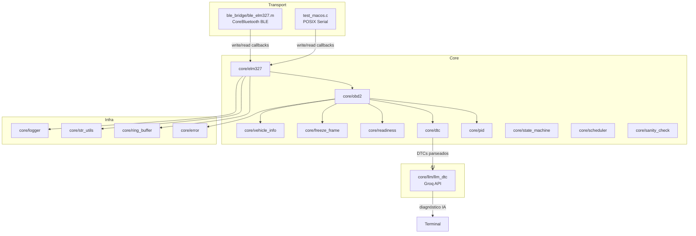

<h1 align="center">🔧 OBD2 Scanner + AI</h1>

<h4 align="center">Leitor OBD-II com ELM327 via BLE/Serial + interpretação de DTCs com IA (Groq/LLaMA)</h4>

<p align="center">
  
  
  
  
  
  
  
</p>

---

## 📖 Sobre o Projeto

Scanner OBD-II que se comunica com adaptadores ELM327 (incluindo clones chineses BLE) e usa inteligência artificial para traduzir códigos de falha (DTCs) em diagnósticos legíveis por humanos.

**Funcionalidades:**

- 🔌 Conexão automática via **BLE** (Bluetooth Low Energy) ou **Serial** com auto-detect de baudrate
- 📡 Leitura de PIDs em tempo real — RPM, velocidade, temperatura, carga do motor, posição do acelerador
- 🧰 Leitura, parsing e limpeza de DTCs com decode completo (Powertrain/Chassis/Body/Network)
- 🤖 **Interpretação de DTCs via IA** — envia os códigos pro Groq (LLaMA 3.3 70B) e recebe diagnóstico com descrição, causas prováveis e severidade
- 🔎 Leitura de VIN e Readiness Monitors
- ✅ **106 testes unitários** cobrindo 8 módulos com Unity framework
- 🧱 Arquitetura modular em C99 com separação de responsabilidades estilo embedded

> Testado em campo com Chevrolet Prisma 2015 + adaptador ELM327 BLE clone chinês no macOS.

---

## ✨ Tecnologias

<details>
  <summary><strong>Core (C99)</strong></summary>

- **C99** com POSIX/termios para serial
- **OBD-II** modos 01, 02, 03, 04, 07, 09, 0A
- **Parser de PIDs** com tabela SAE J1979 (scale/offset/units para 40+ PIDs)
- **DTC Manager** com decode P/C/B/U e storage por tipo (current, pending, permanent)
- **Sanity Check** com validação de range, sensor stuck detection e rate-of-change temporal
- **State Machine** com tabela de transições declarativa (50+ transições)
- **Scheduler** com prioridade, one-shot e tasks periódicas
- **Ring Buffer** e **String Utils** genéricos e reutilizáveis
- **Error Handler** com lookup linear, severidade e flag de recoverability
</details>

<details>
  <summary><strong>BLE Bridge (Objective-C)</strong></summary>

- **CoreBluetooth** para scan, connect, discover services/characteristics
- Suporte a adaptadores ELM327 BLE com service `FFF0`, RX `FFF1` (notify), TX `FFF2` (write)
- Auto-scan sem filtro de service UUID — compatível com clones que não anunciam o service
- Ring buffer thread-safe para dados recebidos via BLE notifications
- Callbacks compatíveis com o core `Elm327_t`
</details>

<details>
  <summary><strong>LLM Integration (C + libcurl)</strong></summary>

- **Groq API** (LLaMA 3.3 70B Versatile) via HTTP/JSON
- Prompt engineering para output estruturado (DESCRIPTION/CAUSES/SEVERITY)
- Suporte a single DTC e batch de múltiplos DTCs
- Integração direta com `DtcManager_t` — interpreta DTCs já parseados
- JSON response parsing em C puro (sem dependências externas além de libcurl)
</details>

<details>
  <summary><strong>Testes (Unity Framework)</strong></summary>

- **106 testes** em **8 suites**
- Cobertura: ring_buffer, str_utils, pid_manager, dtc_manager, state_machine, sanity_check, error_handler, llm_dtc
- Mock de timestamp para testes de rate-of-change temporal
- Testes de conversão PID com valores reais SAE J1979
</details>

---

## 🏛️ Arquitetura



---

## 🚀 Como Executar

**Pré-requisitos:**
- macOS com Xcode Command Line Tools
- libcurl (já inclusa no macOS)
- Conta Groq gratuita para IA (opcional): [console.groq.com/keys](https://console.groq.com/keys)

```bash
xcode-select --install
```

### Scanner BLE (recomendado para clones chineses)

```bash
make clean && make scanner-ble
export GROQ_API_KEY=gsk_sua_chave_aqui   # opcional, para IA
./obd2_scanner_ble
```

### Scanner Serial (para adaptadores com porta serial real)

```bash
make clean && make scanner
export GROQ_API_KEY=gsk_sua_chave_aqui   # opcional, para IA
./obd2_scanner /dev/tty.OBDII            # auto-detect baudrate
./obd2_scanner /dev/tty.OBDII 9600       # baudrate fixo
```

### Rodar testes

```bash
make clean && make test
```

---

## 💻 Uso

```
========================================
       OBD2 Scanner BLE - MacOS
========================================

  1. Ler dados em tempo real
  2. Ler codigos de erro (DTC)
  3. Limpar codigos de erro
  4. Ler VIN
  5. Enviar comando manual
  6. Re-inicializar ELM327
  7. Interpretar DTCs com IA
  0. Sair
```

**Exemplo de saída — dados em tempo real:**
```
=== Dados em Tempo Real ===

  Engine RPM                     0.0 RPM
  Vehicle speed                  0.0 km/h
  Engine coolant temp           44.0 °C
  Calculated engine load         0.0 %
  Throttle position             32.5 %
```

**Exemplo de saída — interpretação IA:**
```
=== Interpretacao LLM (llama-3.3-70b-versatile) ===

  --- P0301 ---
  Descricao:  Cylinder 1 Misfire Detected
  Causas:     Fouled spark plug, weak ignition coil, vacuum leak, low compression
  Severidade: HIGH
```

---

## 📁 Estrutura

```
obd2/
├── core/
│   ├── elm327/          # Driver ELM327 com state machine e callbacks
│   ├── obd2/            # Parser de frames OBD-II (modos 01-0A)
│   ├── pid/             # Tabela de 40+ PIDs com conversão SAE J1979
│   ├── dtc/             # Decode de DTCs (P/C/B/U) com storage por tipo
│   ├── llm/             # Integração Groq API para interpretação de DTCs
│   ├── freeze_frame/    # Captura de freeze frame (modo 02)
│   ├── readiness/       # Readiness monitors (spark/compression)
│   ├── vehicle_info/    # VIN, calibration IDs, ECU names (modo 09)
│   ├── scheduler/       # Task scheduler com prioridade
│   ├── state_machine/   # FSM com tabela de transições declarativa
│   ├── sanity_check/    # Validação temporal de dados de sensores
│   ├── ring_buffer/     # Ring buffer genérico thread-safe
│   ├── str_utils/       # Utilidades de string (copy, contains, hex)
│   ├── error/           # Error handler com lookup linear
│   ├── logger/          # Logger circular com categorias e níveis
│   └── types.h          # Tipos base (u8, u16, Result_t, etc)
├── ble_bridge/
│   ├── ble_elm327.h     # Interface C para bridge BLE
│   └── ble_elm327.m     # CoreBluetooth (Objective-C)
├── ios_bridge/
│   └── bluetooth_if.*   # Abstração BT para futuro app iOS
├── test/
│   ├── unity/           # Unity test framework
│   ├── test_ring_buffer.c
│   ├── test_str_utils.c
│   ├── test_pid_manager.c
│   ├── test_dtc_manager.c
│   ├── test_state_machine.c
│   ├── test_sanity_check.c
│   ├── test_error_handler.c
│   └── test_llm_dtc.c
├── test_macos.c         # Scanner via serial (POSIX)
├── test_macos_ble.m     # Scanner via BLE (CoreBluetooth)
├── Makefile
└── README.md
```

---

## 🛠️ Comandos

```bash
make                # Compilar lib core (libobd2_core.a)
make scanner        # Compilar scanner serial + LLM
make scanner-ble    # Compilar scanner BLE + LLM
make test           # Compilar e rodar 106 testes
make clean          # Limpar build
make check          # Checar sintaxe dos fontes
make info           # Listar fontes e objetos
```

---

## 🧪 Testes

```
=== Running tests ===

--- ring_buffer ---    11 Tests 0 Failures
--- str_utils ---      11 Tests 0 Failures
--- pid_manager ---    15 Tests 0 Failures
--- dtc_manager ---    16 Tests 0 Failures
--- state_machine ---  13 Tests 0 Failures
--- sanity_check ---   16 Tests 0 Failures
--- error_handler ---  12 Tests 0 Failures
--- llm_dtc ---        12 Tests 0 Failures

=== ALL 106 TESTS PASSED ===
```

---

## 🔎 Notas

- **Adaptadores BLE** (clones chineses): use `make scanner-ble` — conecta automaticamente via CoreBluetooth
- **Adaptadores Serial** (OBDLink, ELM327 Bluetooth Classic): use `make scanner` com auto-detect de baudrate
- Alguns clones BLE não anunciam o service UUID no advertisement — o scanner busca por nome (`OBD`, `ELM`, `Vlink`)
- A interpretação IA requer `GROQ_API_KEY` no ambiente — sem ela, as opções 1-6 funcionam normalmente
- Para Bluetooth Classic, parear o dispositivo no macOS antes de executar

---

## 📋 Roadmap

- [ ] App iOS nativo com CoreBluetooth (Swift)
- [ ] Dashboard web com WebSocket para dados em tempo real
- [ ] Banco de dados local de DTCs para modo offline
- [ ] Suporte a mais providers LLM (Claude, OpenAI, modelos locais via llama.cpp)
- [ ] Logging de sessões com export CSV/JSON

---

<h3 align="center">Feito com ❤️ por <a href="https://github.com/lucasmarques594">Lucas Marques</a></h3>